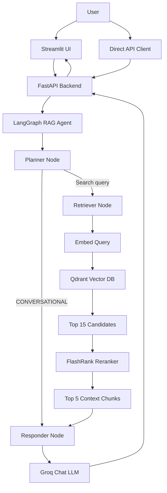
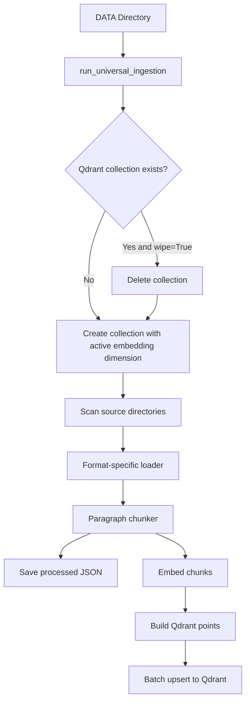

# KUB RAG Assistant Model

An agentic Retrieval-Augmented Generation (RAG) assistant for answering technical documentation questions using FastAPI, LangGraph, Qdrant, Groq, Gemini embeddings, FlashRank, and Streamlit.

---

## Overview

KUB RAG Assistant Model is a documentation question-answering system. It ingests a mixed corpus of Kubernetes and technical reference files, converts them into searchable chunks, stores embeddings in Qdrant, and uses a LangGraph agent workflow to decide whether a user message needs retrieval before generating an answer.

The project is built for developers, DevOps engineers, students, and technical teams who want a conversational assistant over local or enterprise documentation.

Core capabilities include:

- Chat-based question answering through a FastAPI backend.
- A Streamlit frontend with session-scoped conversation memory.
- Document ingestion for PDF, HTML, TXT, Markdown, CSV, JSON, DOCX, and PPTX files.
- Semantic search over Qdrant vector collections.
- Cross-encoder reranking with FlashRank.
- LLM-based planning and response generation through Groq.
- Embedding generation with Gemini embeddings and a local Sentence Transformers fallback.
- Logfire instrumentation for tracing backend, ingestion, graph, and UI activity.

---

## Key Features

- Conversational AI assistant for technical documentation.
- Retrieval-Augmented Generation over local document collections.
- LangGraph workflow with planner, retriever, and responder nodes.
- Query planning that routes conversational messages away from retrieval.
- Qdrant vector database integration.
- Gemini embedding model support.
- Local `sentence-transformers` embedding fallback.
- FlashRank semantic reranking.
- Conversation memory using LangGraph `MemorySaver` and `thread_id`.
- FastAPI API with query and graph visualization endpoints.
- Streamlit chat UI with source-context display.
- Universal ingestion pipeline for multiple document formats.
- Local processed JSON output under `processed_data/`.
- Logfire tracing and logging.
- Unit tests for loaders, chunking, embeddings, and ingestion behavior.

---

## System Architecture

At runtime, the application follows this flow:

```text
User -> Streamlit or API -> FastAPI -> LangGraph Planner
     -> Retriever -> Qdrant -> FlashRank Reranker -> Responder LLM -> Response
```

The planner decides whether a user message is conversational or needs external technical context. If the message can be answered from conversation history, the graph routes directly to the responder. If retrieval is needed, the graph searches Qdrant, reranks retrieved chunks with FlashRank, and passes the best context to the responder.



---

## Request Lifecycle

1. A user sends a query through `POST /query` or through the Streamlit chat UI.
2. FastAPI builds an initial `AgentState` containing the user message, query, empty document list, plan, status, and final answer.
3. FastAPI invokes the compiled LangGraph workflow with `thread_id` in the graph config.
4. The planner node reads the conversation history and latest user message.
5. The planner returns either `CONVERSATIONAL` or a refined search query.
6. If the query is conversational, LangGraph routes directly to the responder.
7. If retrieval is required, the retriever embeds the search query and searches Qdrant for 15 candidates.
8. FlashRank reranks candidate chunks and keeps the top 5.
9. The responder builds a prompt from conversation history and, when available, retrieved technical context.
10. Groq generates the final answer.
11. FastAPI returns the answer, thought process, status, and retrieved source context.

---

## Project Structure

```text
KUB_Rag_Assitant_Model/
├── app/
│   ├── __init__.py
│   ├── config.py
│   ├── main.py
│   ├── observability.py
│   ├── agents/
│   │   ├── graph.py
│   │   ├── state.py
│   │   └── nodes/
│   │       ├── planner.py
│   │       ├── retriever.py
│   │       └── responder.py
│   ├── ingestion/
│   │   ├── __init__.py
│   │   ├── processor.py
│   │   ├── chucking/
│   │   │   ├── __init__.py
│   │   │   └── splitter.py
│   │   └── loaders/
│   │       ├── __init__.py
│   │       ├── html.py
│   │       ├── office.py
│   │       ├── pdf.py
│   │       └── text.py
│   └── services/
│       ├── __init__.py
│       └── retrieval/
│           ├── embeddings.py
│           ├── qdrant_service.py
│           └── ranking_service.py
├── DATA/
│   ├── noisy_data/
│   └── true_data/
├── processed_data/
│   ├── noisy/
│   └── true/
├── scripts/
│   ├── run_ingestion.py
│   └── test_pipeline.py
├── tests/
│   ├── test_chunker.py
│   ├── test_embeddings.py
│   ├── test_loaders.py
│   └── test_processor.py
├── ui/
│   └── app.py
├── main.py
├── pyproject.toml
├── requirements.txt
├── uv.lock
└── README.md
```

### Major Directories

| Path | Purpose |
| --- | --- |
| `app/` | Main backend package containing API, configuration, observability, agents, ingestion, and retrieval services. |
| `app/agents/` | LangGraph state, graph definition, and agent nodes. |
| `app/agents/nodes/` | Planner, retriever, and responder node implementations. |
| `app/ingestion/` | Document parsing, chunking, embedding, processed JSON writing, and Qdrant upsert pipeline. |
| `app/ingestion/loaders/` | Format-specific text extractors for PDF, HTML, text-like files, DOCX, and PPTX. |
| `app/services/retrieval/` | Embedding, Qdrant search, and reranking services. |
| `DATA/` | Source documents split into `true_data` and `noisy_data`. |
| `processed_data/` | JSON files produced by ingestion, grouped by source type. |
| `scripts/` | CLI-style scripts for ingestion and pipeline validation. |
| `tests/` | Pytest unit tests. |
| `ui/` | Streamlit chat frontend. |

---

## Important Files

### `app/main.py`

FastAPI application entry point.

Responsibilities:

- Loads `.env`.
- Configures Logfire before importing application modules.
- Creates `FastAPI(title="Enterprise Agentic RAG API")`.
- Defines the query request schema.
- Exposes API endpoints.
- Invokes the compiled LangGraph `rag_agent`.

Key objects and functions:

- `QueryRequest`: Pydantic model with `q: str` and optional `thread_id`.
- `_state_summary()`: Produces compact debug summaries without dumping full documents.
- `home()`: Returns a health-style message.
- `get_graph_image()`: Returns a PNG image of the LangGraph workflow.
- `query()`: Executes the RAG graph and returns answer metadata.

### `app/config.py`

Central environment configuration.

Key settings:

- `GROQ_API_KEY`
- `GROQ_FALLBACK_API_KEY`
- `GROQ_MODEL`
- `QDRANT_API_KEY`
- `QDRANT_CLUSTER_ENDPOINT`
- `QDRANT_URL`
- `QDRANT_COLLECTION_NAME`
- `GEMINI_API_KEY`

### `app/observability.py`

Reusable Logfire configuration helper.

Key function:

- `configure_logfire(service_name, service_version=None)`: Configures Logfire when credentials are available and disables remote sending when they are not.

### `app/agents/state.py`

Defines the graph state contract.

Key class:

- `AgentState`: Typed dictionary containing `messages`, `current_query`, `documents`, `plan`, `status`, and `final_answer`.

### `app/agents/graph.py`

Builds and compiles the LangGraph workflow.

Key logic:

- Adds `planner`, `retriever`, and `responder` nodes.
- Uses `route_planner()` to choose retrieval or direct response.
- Adds `MemorySaver` checkpointer for thread-based memory.
- Exposes `rag_agent`.

### `app/agents/nodes/planner.py`

Uses Groq via `ChatGroq` to decide if retrieval is needed.

Key function:

- `planner_node(state)`: Builds a planning prompt from the full conversation and returns either `CONVERSATIONAL` or an optimized search query.

### `app/agents/nodes/retriever.py`

Retrieves and reranks relevant technical context.

Key function:

- `retrieve_node(state)`: Searches Qdrant with `search_enterprise_knowledge()`, reranks content with `rerank_documents()`, and stores formatted context in graph state.

### `app/agents/nodes/responder.py`

Generates the final assistant answer.

Key function:

- `generate_node(state)`: Builds either a conversational prompt or a technical-context prompt, invokes Groq, and appends the assistant response to graph memory.

### `app/services/retrieval/embeddings.py`

Embedding service used by ingestion and retrieval.

Key functions:

- `_probe_gemini()`: Tests the Gemini embedding model.
- `_load_fallback()`: Loads local `all-mpnet-base-v2` from Sentence Transformers.
- `_init()`: Initializes the active embedding model.
- `get_embedding_dim()`: Returns the active embedding dimension.
- `embed_query(query)`: Embeds one query string.
- `embed_texts(texts)`: Embeds documents in batches of 50.

Implementation details:

- Gemini uses `models/gemini-embedding-2-preview` with a configured dimension of `3072`.
- The local fallback uses `all-mpnet-base-v2` with a configured dimension of `768`.
- If Gemini batch embedding hits quota or rate-limit errors, the service retries and then switches to the fallback model.
- Fallback vectors can be padded or truncated to match the target collection dimension.

### `app/services/retrieval/qdrant_service.py`

Qdrant search service.

Key functions:

- `get_qdrant_client()`: Creates a Qdrant client from configured URL and API key.
- `search_enterprise_knowledge(query, limit=15)`: Embeds the query, searches the configured collection, and returns content plus metadata.

### `app/services/retrieval/ranking_service.py`

FlashRank reranking service.

Key functions:

- `_get_ranker()`: Lazily initializes `Ranker`, using `/tmp/flashrank` as the preferred cache directory.
- `rerank_documents(query, documents, top_n=5)`: Reranks candidate passages and returns the best document texts. If reranking fails, it falls back to the original retrieval order.

### `app/ingestion/processor.py`

Universal ingestion pipeline.

Key functions:

- `save_processed_locally(data, source_type, filename)`: Writes processed chunks to `processed_data/<source_type>/<filename>.json`.
- `_iter_batches(items, batch_size)`: Yields Qdrant upsert batches.
- `process_file(file_path, filename, source_type, qdrant_client=None)`: Parses, chunks, embeds, saves, and upserts a single file.
- `process_directory(dir_path, source_type, qdrant_client=None)`: Processes all files in one directory and continues after per-file errors.
- `run_universal_ingestion(base_dir, explicit_source_type=None, wipe=False)`: Creates or resets the Qdrant collection and processes either a flat directory or subdirectories.

### `app/ingestion/chucking/splitter.py`

Text chunking utility.

Key function:

- `chunk_text(text, chunk_size=1500)`: Splits text on paragraph boundaries into non-empty chunks.

### `app/ingestion/loaders/pdf.py`

PDF parser.

Key function:

- `parse_pdf(file_path)`: Validates the file, extracts page text with `pypdf.PdfReader`, skips empty or failed pages, normalizes text, and returns one string.

### `app/ingestion/loaders/html.py`

HTML parser.

Key function:

- `parse_html(file_path)`: Uses BeautifulSoup, removes `script`, `style`, `meta`, and `noscript` tags, and returns cleaned text.

### `app/ingestion/loaders/text.py`

Plain text parser.

Key function:

- `parse_text(file_path)`: Supports `.txt`, `.md`, `.csv`, and `.json`, then returns normalized text.

### `app/ingestion/loaders/office.py`

Office document parser.

Key function:

- `parse_office(file_path)`: Routes `.docx` to paragraph extraction and `.pptx` to slide shape text extraction.

### `ui/app.py`

Streamlit frontend.

Responsibilities:

- Loads `.env` from the repository root.
- Configures Logfire for UI spans.
- Creates a UUID session ID.
- Sends chat prompts to `BACKEND_URL/query`.
- Displays backend thought-process steps.
- Shows retrieved source chunks in expanders.
- Streams the final answer visually in the UI.

### `scripts/run_ingestion.py`

Runs the production ingestion flow:

```bash
python scripts/run_ingestion.py
```

It configures Logfire and runs `run_universal_ingestion(base_dir="DATA", wipe=True)`.

### `scripts/test_pipeline.py`

Temporary end-to-end validation script using fake embedding and Qdrant clients for smoke testing the ingestion pipeline.

### `main.py`

Minimal root-level entry point that configures Logfire and prints a startup message. It does not start the API server.

---

## Core Components

### Agents

The agent system is implemented with LangGraph.

| Agent Component | File | Purpose |
| --- | --- | --- |
| Planner | `app/agents/nodes/planner.py` | Decides whether the latest user message needs external retrieval. |
| Retriever | `app/agents/nodes/retriever.py` | Fetches candidate chunks from Qdrant and reranks them. |
| Responder | `app/agents/nodes/responder.py` | Generates the final answer with Groq. |
| Graph | `app/agents/graph.py` | Connects the nodes and compiles the workflow with memory. |

Planner routing is simple:

- `CONVERSATIONAL` -> `responder`
- any refined search query -> `retriever` -> `responder`

### Retrieval System

The retrieval system searches the configured Qdrant collection.

1. `search_enterprise_knowledge()` receives a query.
2. `embed_query()` converts the query into a vector.
3. Qdrant `query_points()` searches the configured collection with cosine distance.
4. The service returns payload fields including text, score, filename, source type, and chunk index.

The retriever asks Qdrant for 15 candidates by default.

### Reranking System

The reranking layer uses FlashRank.

Vector search is fast, but it can return chunks that are semantically close without being the best final evidence. FlashRank applies a cross-encoder-style reranking step to score each candidate against the exact query. The current retriever keeps the top 5 reranked chunks.

If FlashRank fails, the system falls back to the original Qdrant order so the request can still continue.

### LLM Layer

The project uses `langchain-groq` and `ChatGroq`.

Configured model:

```text
llama-3.3-70b-versatile
```

The planner uses the LLM to classify the latest message as conversational or retrieval-needed. The responder uses the LLM to generate either:

- a conversation-only answer from chat history, or
- a technical answer from retrieved context plus conversation history.

The responder is configured with `temperature=0.0` and `max_tokens=100`.

### Memory System

Conversation memory is handled by LangGraph `MemorySaver`.

FastAPI passes this config into every graph invocation:

```python
{"configurable": {"thread_id": thread_id}}
```

The Streamlit UI creates a UUID session ID and sends it as `thread_id`. Clearing history generates a new UUID, which starts a new memory thread.

Memory is in-process and in-memory. It is useful for local sessions, but it is not persisted to a database.

### Observability

The code uses Logfire spans and logs across the backend, graph nodes, ingestion pipeline, retrieval, reranking, and UI.

Important details:

- `app/main.py` configures Logfire before importing app modules so startup and module-level spans can be captured.
- `app/observability.py` safely disables remote Logfire sending when credentials are absent.
- `ui/app.py` reports UI/backend interaction spans.
- Ingestion uses spans for directory scanning, file processing, embedding, and upserts.

---

## Data Ingestion Flow



Supported source extensions:

| Extension | Loader |
| --- | --- |
| `.pdf` | `parse_pdf()` |
| `.html`, `.htm` | `parse_html()` |
| `.txt`, `.md`, `.csv`, `.json` | `parse_text()` |
| `.docx`, `.pptx` | `parse_office()` |

Source type assignment:

- Directories containing `true` become source type `true`.
- Directories containing `noisy` become source type `noisy`.
- Other subdirectories use their directory name.
- A flat directory without an explicit source type becomes `general`, unless its own name includes `true` or `noisy`.

---

## Technology Stack

| Category | Technology | Purpose |
| --- | --- | --- |
| API | FastAPI | Backend HTTP API. |
| ASGI Server | Uvicorn | Runs the FastAPI app. |
| Frontend | Streamlit | Chat UI. |
| Agent Workflow | LangGraph | Planner/retriever/responder graph orchestration. |
| Agent Memory | LangGraph `MemorySaver` | Thread-scoped in-memory conversation state. |
| LLM | Groq via `langchain-groq` | Planning and final answer generation. |
| Embeddings | Google Gemini embeddings | Primary embedding model. |
| Embedding Fallback | Sentence Transformers `all-mpnet-base-v2` | Local fallback embeddings. |
| Vector Database | Qdrant | Stores and searches document chunk vectors. |
| Reranking | FlashRank | Cross-encoder-style semantic reranking. |
| PDF Parsing | pypdf | PDF page text extraction. |
| HTML Parsing | BeautifulSoup | HTML cleanup and text extraction. |
| Office Parsing | python-docx, python-pptx | DOCX and PPTX text extraction. |
| Configuration | python-dotenv | Loads environment variables from `.env`. |
| Observability | Logfire, Loguru | Tracing and logging. |
| Testing | Pytest | Unit tests. |
| Tooling | Ruff, Black, MyPy | Development linting, formatting, and typing tools. |

Note: `pyproject.toml` also lists packages such as `chromadb`, `langchain-openai`, and `pdfplumber`, but the inspected application code currently uses Qdrant, Groq, Gemini, Sentence Transformers, pypdf, BeautifulSoup, python-docx, and python-pptx for the main runtime paths.

---

## Installation

### 1. Clone the repository

```bash
git clone <repository-url>
cd KUB_Rag_Assitant_Model
```

### 2. Create and activate a virtual environment

The project declares Python `>=3.14` in `pyproject.toml`.

```bash
python3.14 -m venv .venv
source .venv/bin/activate
```

### 3. Install dependencies

Using `uv`:

```bash
uv sync
```

Or using `pip`:

```bash
pip install -r requirements.txt
```

For development dependencies from `pyproject.toml`, use:

```bash
uv sync --dev
```

### 4. Configure environment variables

Create a `.env` file in the repository root:

```env
GROQ_API_KEY=your_groq_api_key
GROQ_FALLBACK_API_KEY=optional_fallback_key
GEMINI_API_KEY=your_gemini_api_key
QDRANT_URL=https://your-qdrant-endpoint
QDRANT_CLUSTER_ENDPOINT=https://your-qdrant-endpoint
QDRANT_API_KEY=your_qdrant_api_key
QDRANT_COLLECTION_NAME=KUB_RAG_Assistant
LOGFIRE_TOKEN=optional_logfire_token
BACKEND_URL=http://localhost:8000
```

### 5. Start Qdrant

The code expects an accessible Qdrant endpoint through `QDRANT_URL` or `QDRANT_CLUSTER_ENDPOINT`. This can be a Qdrant Cloud cluster or another Qdrant deployment.

### 6. Ingest documents

```bash
python scripts/run_ingestion.py
```

This reads `DATA/`, recreates the configured Qdrant collection because `wipe=True`, writes processed JSON under `processed_data/`, and upserts embedded chunks to Qdrant.

---

## Configuration

| Variable | Required For | Default | Description |
| --- | --- | --- | --- |
| `GROQ_API_KEY` | Planner and responder | None | API key used by `ChatGroq`. |
| `GROQ_FALLBACK_API_KEY` | Currently not used by code paths | None | Loaded into settings but not referenced elsewhere. |
| `GEMINI_API_KEY` | Primary embedding model | None | Used by `GoogleGenerativeAIEmbeddings`. |
| `QDRANT_API_KEY` | Qdrant Cloud/private Qdrant | None | API key passed to `QdrantClient`. |
| `QDRANT_CLUSTER_ENDPOINT` | Qdrant connection | None | Fallback endpoint used when `QDRANT_URL` is not set. |
| `QDRANT_URL` | Qdrant connection | `QDRANT_CLUSTER_ENDPOINT` | Main Qdrant URL. |
| `QDRANT_COLLECTION_NAME` | Ingestion and retrieval | `KUB_RAG_Assistant` | Collection used for document chunks. |
| `LOGFIRE_TOKEN` | Observability | None | Enables remote Logfire tracing. |
| `BACKEND_URL` | Streamlit UI | `http://localhost:8000` | Backend base URL used by `ui/app.py`. |

`GROQ_MODEL` is configured in code as:

```text
llama-3.3-70b-versatile
```

---

## Running the Project

### Backend

```bash
uvicorn app.main:app --reload
```

The API will be available at:

```text
http://localhost:8000
```

### Frontend

In a second terminal:

```bash
streamlit run ui/app.py
```

The UI sends requests to `BACKEND_URL`, defaulting to:

```text
http://localhost:8000
```

### Ingestion

```bash
python scripts/run_ingestion.py
```

### Pipeline Smoke Test Script

```bash
python scripts/test_pipeline.py
```

### Unit Tests

```bash
pytest
```

### Production Mode

The repository does not include Docker, process-manager, or deployment configuration. A typical production command for the backend would be:

```bash
uvicorn app.main:app --host 0.0.0.0 --port 8000
```

For Streamlit:

```bash
streamlit run ui/app.py --server.address 0.0.0.0 --server.port 8501
```

---

## API Documentation

### `GET /`

Purpose: Confirms that the backend API is running.

Request:

```bash
curl http://localhost:8000/
```

Response:

```json
{
  "message": "Enterprise LangGraph RAG API is live."
}
```

### `GET /graph`

Purpose: Returns a PNG image of the LangGraph workflow.

Request:

```bash
curl http://localhost:8000/graph --output graph.png
```

Successful response:

```text
Content-Type: image/png
```

Error response:

```json
{
  "error": "Could not generate graph image: <error details>"
}
```

### `POST /query`

Purpose: Executes the LangGraph RAG flow with conversation memory.

Request schema:

```json
{
  "q": "string",
  "thread_id": "string, optional, defaults to default_user"
}
```

Request:

```bash
curl -X POST http://localhost:8000/query \
  -H "Content-Type: application/json" \
  -d '{
    "q": "Explain Kubernetes Horizontal Pod Autoscaler",
    "thread_id": "demo-session-1"
  }'
```

Response schema:

```json
{
  "question": "string",
  "answer": "string",
  "thought_process": ["string"],
  "status": "string",
  "sources": ["string"]
}
```

Example response:

```json
{
  "question": "Explain Kubernetes Horizontal Pod Autoscaler",
  "answer": "The Horizontal Pod Autoscaler adjusts the number of pod replicas based on observed metrics such as CPU utilization.",
  "thought_process": [
    "Intent: External Search Required",
    "Action: Execute search with query \"Kubernetes Horizontal Pod Autoscaler overview and working\"",
    "Context Retrieved"
  ],
  "status": "Response Generated",
  "sources": [
    "CONTENT: Horizontal Pod Autoscaler automatically updates a workload resource..."
  ]
}
```

Error response:

```json
{
  "question": "Explain Kubernetes Horizontal Pod Autoscaler",
  "answer": "I apologize, but I encountered an internal error while processing your request. Please try again later.",
  "thought_process": ["Error encountered during execution."],
  "status": "error",
  "sources": []
}
```

---

## Example Usage

### Technical Query

User:

```text
How do Kubernetes CronJobs work?
```

Expected lifecycle:

- Planner converts the message into a retrieval query.
- Retriever searches Qdrant.
- FlashRank keeps the most relevant chunks.
- Responder answers from retrieved technical context.

### Conversational Query

User:

```text
Hi
```

Expected lifecycle:

- Planner returns `CONVERSATIONAL`.
- Graph skips retrieval.
- Responder answers using conversation history only.

### Follow-up Query With Memory

User:

```text
Can you summarize that again?
```

If the same `thread_id` is used, the planner can classify the message as conversational because prior messages are available through LangGraph memory.

---

## Design Decisions

### LangGraph for Agent Workflow

The graph is explicit and easy to inspect. Planner, retriever, and responder are separate nodes, and `route_planner()` clearly controls whether retrieval is needed.

### Qdrant for Vector Search

Qdrant is used as the vector database for document chunks. The ingestion pipeline creates a collection with cosine distance and upserts points with text and source metadata.

### Gemini Embeddings With Local Fallback

Gemini embeddings are the primary embedding path. The local Sentence Transformers fallback keeps the pipeline usable if Gemini is unavailable or quota-limited.

### FlashRank for Reranking

The retriever first gets a broader candidate set from Qdrant, then FlashRank reranks the candidates to improve final context quality.

### MemorySaver for Conversation Memory

`MemorySaver` provides thread-scoped memory without adding an external database. This keeps local development simple, but memory is not durable across process restarts.

### Logfire for Observability

The code uses Logfire spans around important execution units: API calls, planning, retrieval, reranking, response generation, ingestion, and UI/backend calls.

---

## Testing

The test suite currently covers:

- HTML, text, PDF, DOCX, and PPTX loader behavior.
- Empty and invalid loader inputs.
- Chunker normal, empty, and invalid-size cases.
- Embedding model initialization and fallback behavior.
- Processor behavior for saving JSON, unsupported extensions, no chunks, collection creation, wiping, and directory-level error continuation.

Run tests:

```bash
pytest
```

---

## Future Improvements

- Persist LangGraph memory with a durable checkpointer.
- Add authentication and rate limiting to the FastAPI API.
- Add Docker or Compose files for reproducible local deployment.
- Add health checks for Qdrant, Groq, Gemini, and Logfire.
- Store richer source metadata in API responses instead of source text strings only.
- Add streaming backend responses instead of Streamlit-only visual streaming.
- Add integration tests against a real or containerized Qdrant instance.
- Add configurable model names, chunk size, retrieval limit, and rerank `top_n`.
- Fix the `app/ingestion/chucking/` directory name if the intended name is `chunking`.
- Document or remove dependencies listed in `pyproject.toml` that are not currently used by the code.

---

## Contributing

Contributions are welcome.

Suggested workflow:

1. Create a feature branch.
2. Install development dependencies.
3. Make focused changes.
4. Add or update tests for behavior changes.
5. Run `pytest`.
6. Open a pull request with a clear description of the change and any operational impact.

Development commands:

```bash
pytest
ruff check .
black .
mypy app
```

---

## License

No license file is present in the repository. Until a license is added, reuse and redistribution rights are not explicitly granted.
